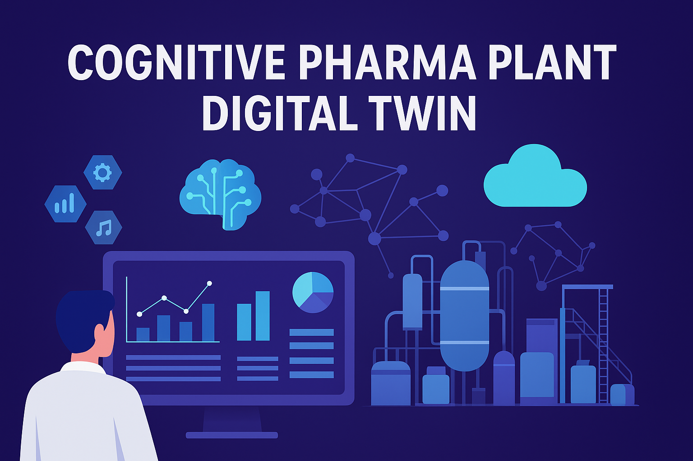

# 🧬 Cognitive Pharma 4.0 Plant Digital Twin Simulator

An **industrial-scale pharmaceutical manufacturing** digital twin for **penicillin production**.  
This simulator integrates **realistic batch process data**, **fault simulation**, **predictive analytics**, and an **interactive knowledge graph** — enabling fault detection, yield prediction, and risk assessment.

[](https://www.python.org/)
[](https://streamlit.io/)
[](https://www.kaggle.com/)
[](https://scikit-learn.org/)



---

## ⚡ Features

- **Kaggle Dataset Integration**: Load datasets directly using your Kaggle API key.
- **Fault Injection Simulation**: Test plant resilience with customizable fault probabilities.
- **Predictive Modeling**: Random Forest predicts batch yields; RMSE displayed for accuracy.
- **Batch Simulation**: Generate multiple batches with predicted yields, risk scores, and event types.
- **AI Recommendations**: Get actionable advice for high-risk batches.
- **Knowledge Graph Visualization**:
  - Assets and batches visualized as nodes
  - Risk-based color coding (green → red)
  - Click batch nodes for detailed metrics and recommendations
- **Dataset Summary**: Key production statistics like total yield and faulty batches.

---

## 🏭 Pharma 4.0 Integration

This dashboard aligns with **Pharma 4.0** principles by enabling:

- **Digital Twin of the Plant**: Real-time virtual replication of the penicillin production process.
- **Predictive Analytics**: Machine learning models anticipate batch outcomes, reducing waste and downtime.
- **Smart Decision Support**: AI provides recommendations for high-risk batches to optimize quality and efficiency.
- **Process Optimization**: Simulation and fault injection allow testing of process changes before implementation.
- **Knowledge Graph Visualization**: Connects assets, batches, and events for transparent and data-driven insights.
- **Data-Driven Compliance**: Centralized monitoring ensures adherence to industry regulations and quality standards.

> Pharma 4.0 is about connecting people, processes, and data with advanced digital technologies. This dashboard transforms traditional batch production into an intelligent, predictive, and resilient manufacturing system.

---

## 🚀 User Instructions

### Quick Start Guide

1. **Upload Kaggle API Key**  
   - Upload your `kaggle.json` file if prompted.  
   - This lets the app download the dataset directly from Kaggle without manual setup.

2. **Load Dataset**  
   - The dataset contains both *normal* and *faulty* production batches.  
   - Faulty batches simulate real-world production problems such as `Cold_Storage_Issue` or `Faulty_Batch`.  
   - These batches usually have **lower predicted yields** and **higher risk scores**.

3. **Enable Faulty Batch Simulation** *(Optional)*  
   - Toggle the **"Chance of Faulty Batch (%)"** in the simulation panel if you want to include faults in your test runs.  
   - **Example:** If set to `30%`, roughly 3 out of 10 simulated batches will be faulty.  
   - Use higher values to stress-test your system’s ability to detect and handle problems.

4. **Train Model**  
   - The Random Forest model is automatically trained using the loaded dataset.  
   - The **RMSE (Root Mean Squared Error)** is displayed after training:
       - **Low RMSE** = predictions are close to actual yields (good accuracy).  
       - **High RMSE** = predictions are less accurate.  
       - Example: RMSE = 0.05 means the prediction is off by about ±0.05 kg on average.

5. **Simulate Batches**  
   - Select:
       - **Event type**: `Normal`, `Cold_Storage_Issue`, `Faulty_Batch`, etc.  
       - **Number of batches** to simulate.  
       - **Chance of Faulty Batch (%)** if enabled.  
   - Click **"Simulate Batches"** to generate predictions, risk scores, and AI recommendations.

6. **Review Results**  
   - **Simulated Batches Table**: Shows predicted yield, risk score, and event type.  
   - **AI Recommendations**: Actionable advice for high-risk or faulty batches.  
   - **Knowledge Graph**:  
       - Visualizes relationships between batches and assets.  
       - **Green** = normal  
       - **Yellow/Orange/Red** = increasing fault severity  
       - **Gold** = most recent batch simulated

7. **Understanding Faulty Batches in the Results**  
   - Faulty batches are:
       - Marked with a **non-green** node in the graph.  
       - Listed in the table with their specific fault type under `Event`.  
       - Paired with non-"Normal operation" AI advisories in the recommendations panel.

8. **Batch Details Panel**  
   - Enter a batch number to see detailed metrics and recommendations.
---

## 💻 Installation

### Clone repository
```bash
git clone https://github.com/camontefusco/Cognitive_Pharma4.0_Plant_Digital_Twin_Simulator.git
cd Cognitive_Pharma4.0_Plant_Digital_Twin_Simulator
```
### Install dependencies
```bash
pip install streamlit pandas numpy networkx pyvis scikit-learn kaggle
```
### Set up Kaggle API

1. Go to [Kaggle Account](https://www.kaggle.com/me/account) → **Create API Token** → Download `kaggle.json`.
2. Place `kaggle.json` in the root of the cloned repo.
3. Set environment variable for Kaggle API:
```bash
export KAGGLE_CONFIG_DIR=.
```

### Run the Streamlit app
```bash
streamlit run app.py
```

## 📬 Contact
Carlos Montefusco
📧 cmontefusco@gmail.com
🔗 GitHub: /camontefusco
